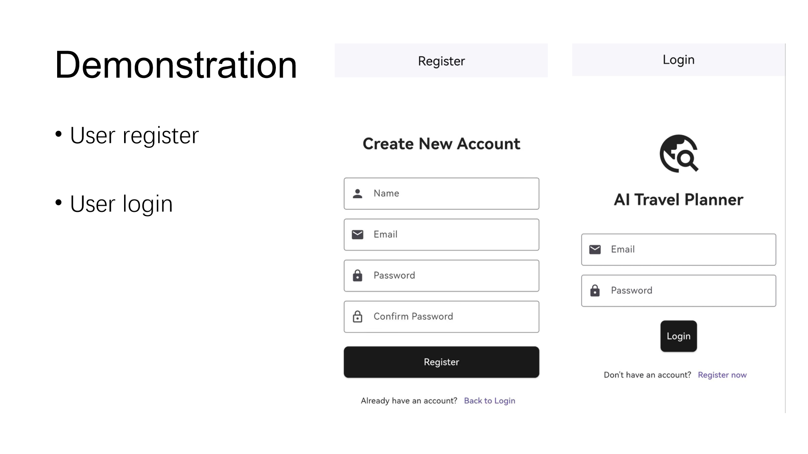
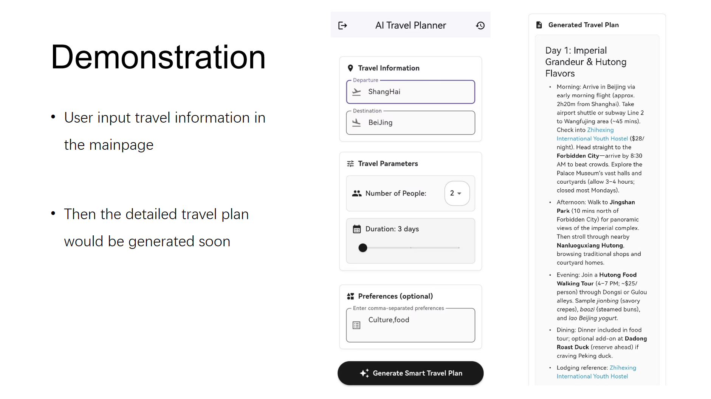
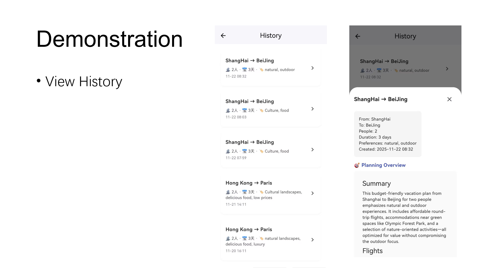

# TralP - AI Travel Planner

🌍 基于 Flask、Firebase 和 CrewAI 的智能旅行规划系统

一个可扩展的旅行规划平台，使用 AI agents 自动生成个性化旅行计划，支持用户认证、数据持久化和第三方 API 集成。







## ✨ 特性

- 🤖 **AI 驱动**：使用 CrewAI agents 自动研究和规划旅行
- 🔐 **用户认证**：基于 Firebase Authentication 的安全认证
- 💾 **数据持久化**：Firebase Realtime Database 存储用户数据和旅行计划
- 🗺️ **地图集成**：预留高德地图 API 接口
- ✈️ **旅行服务**：预留携程旅行 API 接口
- 📱 **RESTful API**：完整的 REST API 设计
- 🔄 **异步处理**：支持旅行计划异步生成
- 📊 **模块化架构**：清晰的目录结构，易于扩展

## 🏗️ 项目架构

```
TralP/
├── app/                          # 应用主目录
│   ├── __init__.py              # Flask 应用工厂
│   ├── config.py                # 配置管理
│   ├── models/                  # 数据模型（Pydantic）
│   │   ├── user.py             # 用户模型
│   │   └── travel_plan.py      # 旅行计划模型
│   ├── routes/                  # API 路由
│   │   ├── auth.py             # 认证路由
│   │   └── travel.py           # 旅行规划路由
│   ├── services/                # 业务逻辑层
│   │   ├── firebase_service.py # Firebase 服务
│   │   ├── ai_service.py       # AI 服务
│   │   └── third_party/        # 第三方 API
│   │       ├── amap_service.py # 高德地图
│   │       └── ctrip_service.py# 携程旅行
│   ├── agents/                  # CrewAI Agents
│   │   ├── planner_agent.py    # 规划 Agent
│   │   └── writer_agent.py     # 编写 Agent
│   ├── tools/                   # AI Tools
│   │   └── search_tool.py      # 搜索工具
│   └── utils/                   # 工具函数
│       ├── decorators.py       # 装饰器
│       └── validators.py       # 验证器
├── tests/                       # 测试
├── static/                      # 静态资源
├── templates/                   # 模板
├── requirements.txt             # Python 依赖
├── .env.example                # 环境变量示例
├── .gitignore                  # Git 忽略文件
├── run.py                      # 应用入口
└── README.md                   # 项目文档
```

## 🚀 快速开始

### 1. 环境要求

- Python 3.9+
- Firebase 项目（用于认证和数据库）
- Ollama（本地 LLM）或其他 LLM 提供商

### 2. 安装

```bash
# 克隆项目
git clone <repository-url>
cd TralP

# 创建虚拟环境
python -m venv venv
source venv/bin/activate  # Windows: venv\Scripts\activate

# 安装依赖
pip install -r requirements.txt
```

### 3. 配置

复制 `.env.example` 为 `.env` 并配置：

```bash
cp .env.example .env
```

编辑 `.env` 文件：

```env
# Flask
SECRET_KEY=your-secret-key
DEBUG=True

# Firebase
FIREBASE_API_KEY=your-firebase-api-key
FIREBASE_AUTH_DOMAIN=your-project.firebaseapp.com
FIREBASE_DATABASE_URL=https://your-project.firebaseio.com
FIREBASE_PROJECT_ID=your-project-id
# ... 其他 Firebase 配置

# LLM
LLM_MODEL=ollama/llama3.2:1b
LLM_BASE_URL=http://127.0.0.1:11434
LLM_PROVIDER=ollama

# API Keys
SERPER_API_KEY=your-serper-api-key
AMAP_API_KEY=your-amap-api-key
CTRIP_API_KEY=your-ctrip-api-key
CTRIP_API_SECRET=your-ctrip-secret
```

### 4. Firebase 设置

1. 创建 Firebase 项目：https://console.firebase.google.com/
2. 启用 Authentication（Email/Password）
3. 启用 Realtime Database
4. 下载 Service Account 凭证（JSON）并保存为 `firebase-admin-sdk.json`
5. 将凭证文件路径配置到 `.env`

### 5. 运行

```bash
# 启动 Ollama（如果使用本地 LLM）
ollama serve

# 启动 Flask 应用
python run.py
```

应用将在 `http://localhost:5000` 启动。

## 📡 API 使用

### 认证

#### 注册用户

```bash
curl -X POST http://localhost:5000/api/auth/register \
  -H "Content-Type: application/json" \
  -d '{
    "email": "user@example.com",
    "password": "password123",
    "display_name": "张三"
  }'
```

#### 登录（客户端）

使用 Firebase SDK 在客户端登录：

```javascript
// JavaScript 示例
import { getAuth, signInWithEmailAndPassword } from "firebase/auth";

const auth = getAuth();
signInWithEmailAndPassword(auth, email, password)
  .then((userCredential) => {
    // 获取 ID token
    userCredential.user.getIdToken().then((token) => {
      // 在 API 请求中使用 token
      console.log("Token:", token);
    });
  });
```

### 旅行规划

#### 创建旅行计划

```bash
curl -X POST http://localhost:5000/api/travel/plan \
  -H "Content-Type: application/json" \
  -H "Authorization: Bearer <firebase_id_token>" \
  -d '{
    "from_location": "北京",
    "destination": "成都",
    "num_people": 2,
    "duration": 5,
    "budget": 5000
  }'
```

#### 查询计划状态

```bash
curl http://localhost:5000/api/travel/plans/<plan_id>/status \
  -H "Authorization: Bearer <firebase_id_token>"
```

#### 获取完整计划

```bash
curl http://localhost:5000/api/travel/plans/<plan_id> \
  -H "Authorization: Bearer <firebase_id_token>"
```

#### 获取所有计划

```bash
curl http://localhost:5000/api/travel/plans \
  -H "Authorization: Bearer <firebase_id_token>"
```

更多 API 文档请参考：[app/routes/README.md](app/routes/README.md)

## 🧪 测试

```bash
# 运行所有测试
pytest tests/

# 运行特定测试
pytest tests/test_services.py -v

# 生成覆盖率报告
pytest tests/ --cov=app --cov-report=html
```

## 📚 文档

每个模块都有详细的 README 文档：

- [Models](app/models/README.md) - 数据模型定义
- [Services](app/services/README.md) - 业务逻辑层
- [Third-party APIs](app/services/third_party/README.md) - 第三方 API 集成
- [Agents](app/agents/README.md) - AI Agents 定义
- [Tools](app/tools/README.md) - AI Tools
- [Routes](app/routes/README.md) - API 路由
- [Utils](app/utils/README.md) - 工具函数
- [Tests](tests/README.md) - 测试说明

## 🔧 配置说明

### LLM 配置

支持多种 LLM 提供商：

```env
# Ollama (本地)
LLM_MODEL=ollama/llama3.2:1b
LLM_BASE_URL=http://127.0.0.1:11434
LLM_PROVIDER=ollama

# OpenAI
LLM_MODEL=gpt-4
LLM_PROVIDER=openai
OPENAI_API_KEY=your-api-key

# 其他提供商...
```

### Firebase 数据库结构

```json
{
  "users": {
    "<user_id>": {
      "email": "user@example.com",
      "display_name": "张三",
      "created_at": "2025-10-30T12:00:00Z",
      "preferences": {}
    }
  },
  "travel_plans": {
    "<user_id>": {
      "<plan_id>": {
        "plan_id": "...",
        "status": "completed",
        "request": {},
        "flights": [],
        "accommodations": [],
        "itinerary": [],
        "created_at": "..."
      }
    }
  }
}
```

## 🌟 扩展开发

### 添加新的第三方 API

1. 在 `app/services/third_party/` 创建新服务文件
2. 实现服务类（参考 `amap_service.py`）
3. 在 `.env` 中添加 API 密钥
4. 在 `app/config.py` 中配置

### 添加新的 Agent

1. 在 `app/agents/` 创建新 agent 文件
2. 实现 `create_agent()` 和 `create_task()` 函数
3. 在 `app/services/ai_service.py` 中集成

### 添加新的 API 端点

1. 在 `app/routes/` 中定义新路由
2. 使用装饰器：`@require_auth`、`@handle_errors`
3. 在 `app/__init__.py` 中注册蓝图

## 🐛 常见问题

### Firebase 初始化失败

确保 `firebase-admin-sdk.json` 文件存在且路径正确。

### LLM 连接失败

- Ollama: 确保 Ollama 服务正在运行（`ollama serve`）
- OpenAI: 检查 API key 是否正确

### 端口已被占用

修改 `.env` 中的 `FLASK_PORT` 或在运行时指定：

```bash
FLASK_PORT=8000 python run.py
```

## 📝 开发规范

- 代码风格：遵循 PEP 8
- 类型提示：使用 Python type hints
- 文档字符串：使用 Google 风格 docstrings
- 提交信息：使用清晰的提交信息

## 🤝 贡献

欢迎提交 Pull Request！请确保：

1. 代码通过所有测试
2. 添加必要的测试用例
3. 更新相关文档
4. 遵循项目代码规范

## 📄 许可证

[MIT License](LICENSE)

## 👥 作者

Your Name - your.email@example.com

## 🙏 致谢

- [Flask](https://flask.palletsprojects.com/)
- [CrewAI](https://github.com/joaomdmoura/crewAI)
- [Firebase](https://firebase.google.com/)
- [Pydantic](https://pydantic-docs.helpmanual.io/)

---

**注意**：这是一个基础框架，第三方 API（高德地图、携程）需要实际的 API 凭证才能使用。请根据实际需求进行配置和扩展。

